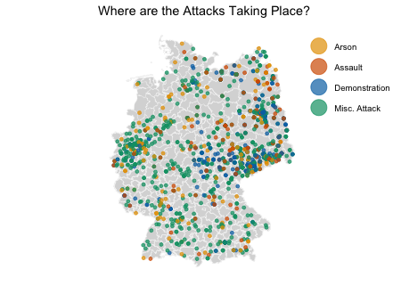

# Anti-Refugee Violence in Germany       

`Code` contains code used in this project

`Data` contains data used in this project

`Paper` contains the final write up with methods and results used for this project

#### Purpose
The purpose of the study is to interpret the drivers and consequences of right-wing violence due to the rise of xenophobic attacks against refugees in Germany. The number of refugees seeking asylum in Germany, as well as the number of xenophobic attacks against refugees has been on the rise. There is a need for systematic data collection and data processing in order to examine a broad range of research questions regarding xenophobic extremism in Germany. 

This dataset categorizes four types of right-wing political violence and social unrest, and shows us the frequency, geographic location, and time of these events.	

#### Research Questions
1. What geographic locations within Germany have a high number of attacks against refugees?

2. What/when are the most frequent types of attacks? 

3. Is there a correlation between the type and time/date of attack, such as events that precede or follow the attack? 

#### An illustration of the type of attacks by location in Germany (2014-2017)

More visualizations can be seen in the code.R file.

#### Results

The results have a potential social impact on the political climate in Germany. The results
from our analyses inform us about the frequency of attacks based on the time of year. Elections
in Germany are held at certain times, so the political climate may shape attitudes towards
refugees. Depending on the officials elected, their stance on immigration can determine the
policies in place. Border policies and immigration laws implemented will directly affect
refugees. The analyses also show us which communities have the highest frequencies of attacks.
We also know the frequency of attacks in the four most populous German states. Nordrhein-
Westfalen, one of the four most populous German states, has the highest number of attacks. This
information can be turned into practice by increasing security measures in these communities
where the most attacks happen, especially in Nordrhein-Westfalen where there are a lot of
residents.

